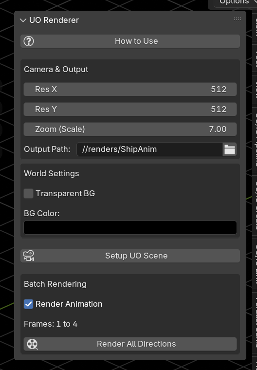
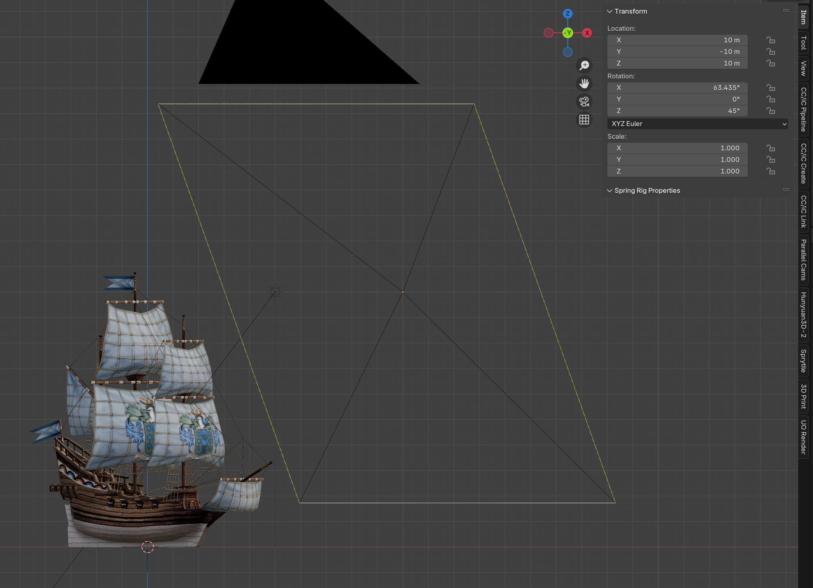
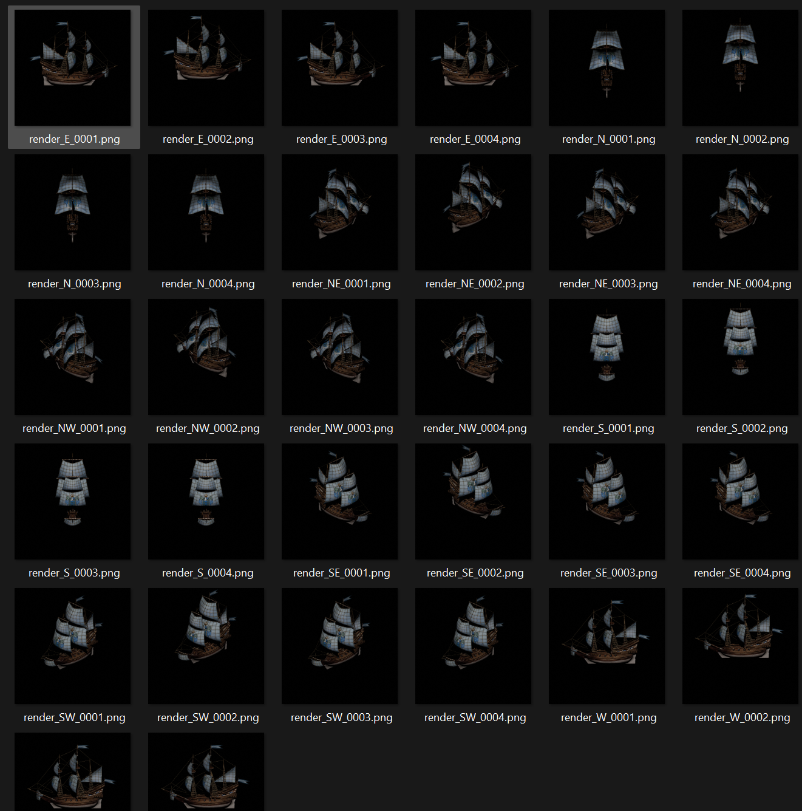

# **UO Isometric Renderer for Blender**

A Blender Add-on that automates the creation of 8-directional isometric sprites for *Ultima Online*.

This tool handles the specific camera geometry (Dimetric projection), lighting, and batch rendering required to create perfectly aligned static images and animations for the UO engine.

## **🌟 Features**

* **One-Click Scene Setup:** Instantly creates the camera, sun, and anchor object with the mathematically correct angles for UO (2:1 pixel ratio).  
* **Batch Rendering:** Automatically renders all 8 compass directions (N, NE, E, SE, S, SW, W, NW) in one go.  
* **Animation Support:** Renders full animation sequences for every direction.  
* **Background Control:** Toggle transparency or set specific background colors (e.g., solid black) directly from the UI.  
* **Integrated UI:** Simple control panel in the Blender Sidebar.



## **📦 Installation**

1. **Download:** Download the uo_isometric_renderer.py file from this repository.  
2. **Open Blender:** Go to Edit > Preferences.  
3. **Install:**  
   * Select the **Add-ons** tab on the left.  
   * Click the **Install...** button at the top right.  
   * Navigate to and select the .py file you downloaded.  
4. **Enable:** Search for "UO" in the add-on list and check the box next to **Render: UO Isometric Renderer**.

## **🚀 Usage**

### **1. Locate the Panel**

In the 3D Viewport, press N on your keyboard to open the Sidebar. Click the tab labeled **UO Render**.

### **2. Scene Setup**

Click the **Setup UO Scene** button in the panel.

* This creates a specialized camera (UO_Iso_Camera), a light (UO_Sun), and an anchor object (UO_Model_Anchor).  
* **Note:** Do not move the camera manually. Use the **Zoom (Scale)** slider in the panel instead.

### **3. Model Setup (Important!)**



1. **Parenting:** Select your 3D model, then hold Shift and select the **UO\_Model\_Anchor** (the yellow cross axes). Press Ctrl \+ P and choose **Object (Keep Transform)**.  
2. **Rotation Correction:** Select your model (not the anchor). Press R, then Z, then 45, and Enter.

[IMPORTANT]

> **Why Rotate?** The UO Camera is angled from the South-East. Rotating your model 45° to the left aligns it with the camera grid, ensuring "North" renders as "North" and not "North-East".

### **4. Customization**

* **Zoom:** Use the Zoom (Scale) property to fit your model in the frame.  
* **Background:**  
  * ✅ Check **Transparent BG** for standard sprite output.  
  * ❌ Uncheck it to use the **BG Color** picker (useful for solid black backgrounds 0,0,0).

## **🎬 Rendering**

**Note:** You must save your .blend file first so the renderer knows where to save the images.

### **Static Images**

Leave "Render Animation" unchecked and click **Render All Directions**.

### **Animations**

1. Set your start and end frames in the Blender timeline.  
2. Check **Render Animation** in the panel.  
3. Click **Render All Directions**.

### **Output**

Renders are saved in a renders folder next to your .blend file.

* **Static:** render_S.png, render_SE.png, etc.  
* **Animation:** render_S_0001.png, render_S_0002.png, etc.



## **🔧 Troubleshooting**

| Issue | Solution |
| :---- | :---- |
| **Model facing wrong way?** | Ensure you performed the 45° Z-axis rotation on your model relative to the Anchor. |
| **Renders look blurry?** | Go to **Render Properties** > **Film** > **Pixel Filter** and set the width to 0.01 for sharp, retro pixels. |
| **Button not working?** | Ensure you have saved your .blend file at least once. |
| **Atlas not creating?** | Pillow auto-installs on first use. If it fails, see manual install instructions below. |

## **📦 Texture Atlas**

Check **Create Texture Atlas** to pack all rendered frames into a single spritesheet.

### **Atlas Layout**
- **Rows** = Directions (N, NE, E, SE, S, SW, W, NW)
- **Columns** = Animation frames (1, 2, 3, 4...)

### **Output Files**
- `texture_atlas.png` - Combined spritesheet
- `texture_atlas.json` - Metadata with frame positions

### **JSON Metadata Structure**
```json
{
  "atlas": { "width": 2048, "height": 4096 },
  "frame": { "width": 512, "height": 512 },
  "directions": [
    { "name": "N", "row": 0, "y": 0 },
    { "name": "NE", "row": 1, "y": 512 }
  ],
  "frames": [
    { "direction": "N", "frame": 0, "x": 0, "y": 0, "width": 512, "height": 512 }
  ]
}
```

### **Pillow Dependency**
The atlas feature requires **Pillow** which auto-installs on first use.

**Manual install (if auto fails):**
1. Open Blender's Python console
2. Run: `import subprocess, sys`
3. Run: `subprocess.check_call([sys.executable, '-m', 'pip', 'install', 'Pillow'])`
4. Restart Blender
